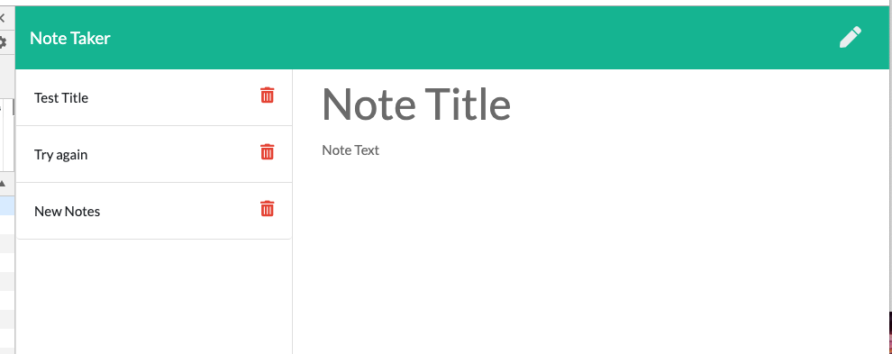
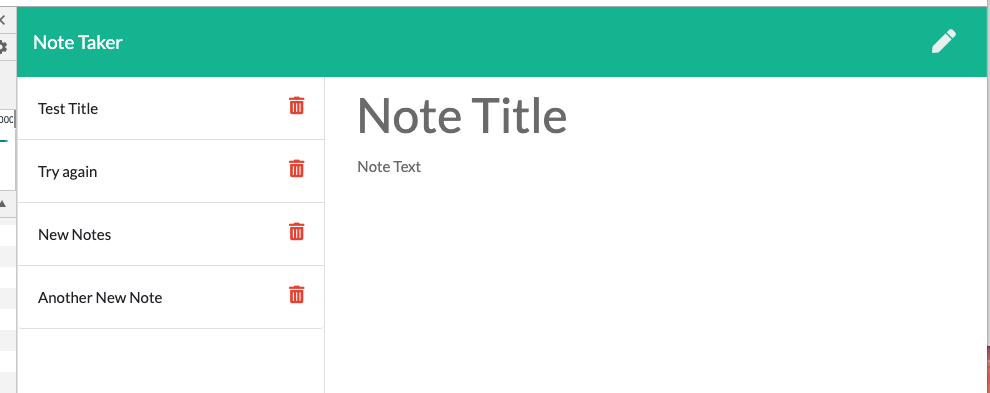

# Unit 11 Express Homework: Note Taker

## Description

Create an application that can be used to write, save, and delete notes. This application will use an express backend and save and retrieve note data from a JSON file.

* The application frontend was provided to me via the homework.  The index.html and notes.html files along with the index.js file.  I created the server.js (an express server) file to run in node via terminal.

## User Story

AS A user, I want to be able to write and save notes

I WANT to be able to delete notes I've written before

SO THAT I can organize my thoughts and keep track of tasks I need to complete

## ScreenShots

## Challenges

This assignment was difficult due to the the moving parts which need to be straightend out.  assigning the routes was relatively straight forward, but creating the Delete functionality was extremely dificult as I continue to recieve a 404 error from the browser console, but my console logs that are set up are not triggering in the terminal which indicates that the route is not reaching the delete method.

- - -

